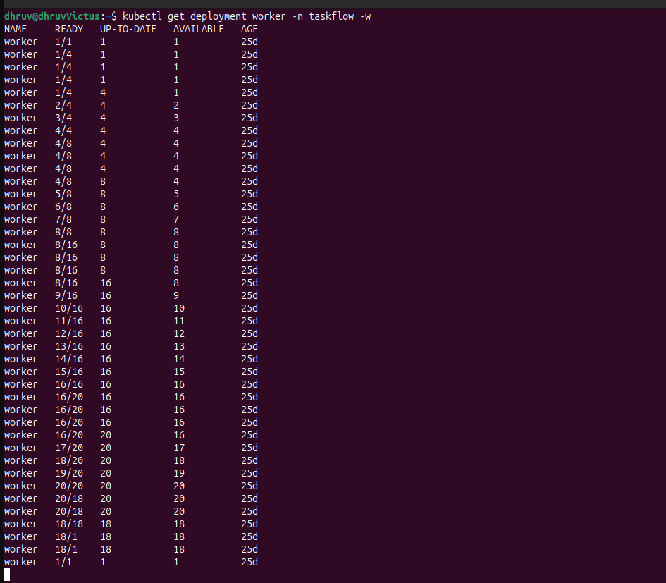

<div align="center">
  <br>
  
  <br>
  <br>
  <h1>TaskFlow</h1>
  
  <p>
    <b>Streamline your workflow with intelligent task management ⚡️</b>
  </p>
  
  
  
  
  
  
  
  

   
  <br />
</div>

## Overview

**TaskFlow v2.0.0** is a production-ready distributed task execution platform with **dynamic code execution** and **intelligent autoscaling**. Upload custom Python tasks at runtime and execute them across a fleet of auto-scaling workers—no container rebuilds required.

The system leverages **FastAPI** for high-performance task submission, **Redis** for message brokering, **PostgreSQL** for persistence, and **KEDA** for event-driven autoscaling based on queue depth.

**Key Capabilities:**
* **Modular Workers:** Upload and execute custom Python code dynamically without redeploying
* **Smart Autoscaling:** KEDA scales workers 2-20 pods based on real-time Redis queue length  
* **Dual-Priority Queues:** Separate high/low priority Redis queues with intelligent routing
* **Async Support:** Execute both `def handler()` and `async def handler()` functions
* **Persistent Storage:** Shared task files across API and worker pods (ReadWriteMany PVC)
* **Production Ready:** Kubernetes-native with automated CI/CD, health checks, and graceful shutdowns
* **One-Command Deploy:** Full stack deployment with `make run-local`

---

## What's New in v2.0.0

### Modular Worker Architecture
Workers dynamically load and execute user-uploaded Python code at runtime:

**1. Upload Your Task:**
```bash
curl -X POST "http://localhost:8080/tasks/upload_file?file_name=process_data" \
  -H "Authorization: Bearer TOKEN" \
  -F "file=@process_data.py"
```

**2. Define Your Handler:**
```python
# process_data.py
async def handler(payload):
    """Your custom logic - can be sync or async"""
    data = payload.get("data", {})
    # Your processing logic here...
    return {"status": "success", "result": data}
```

**3. Create Tasks:**
```bash
curl -X POST "http://localhost:8080/tasks/" \
  -H "Authorization: Bearer TOKEN" \
  -d '{
    "title": "process_data",
    "payload": "{\"data\": {...}}",
    "priority": "low",
    "scheduled_at": 0
  }'
```

**4. Workers Auto-Scale & Execute:**
- Queue builds up → Workers scale from 2 to 20 pods
- Each worker loads `process_data.py` and executes `handler()`
- Results stored in database
- Queue empties → Workers scale back to 2 pods

**Task Requirements:**
- Must contain `handler(payload)` function (sync or async)
- Task `title` must match filename (without `.py`)
- Payload passed as dictionary to handler

---

## Quick Start

### Prerequisites
- [Minikube](https://minikube.sigs.k8s.io/docs/start/) installed
- [kubectl](https://kubernetes.io/docs/tasks/tools/) CLI tool  
- [Docker](https://docs.docker.com/get-docker/)
- [Helm](https://helm.sh/docs/intro/install/) (for KEDA installation)

### Deploy in 3 Commands

```bash
# 1. Install KEDA (autoscaling operator)
make install-keda

# 2. Deploy full stack (builds images, deploys to Minikube)
make run-local

# 3. Access the API
open http://localhost:8080/docs
```

**What gets deployed:**
- FastAPI server (2 replicas) with file upload support
- PostgreSQL + PgBouncer for connection pooling
- Redis (high/low priority queues)
- Queue Manager (batch task processing)
- Workers (2-20 auto-scaling pods)
- KEDA ScaledObject (monitors Redis queue)
- Persistent volume for shared task files

---

## See TaskFlow in Action

**[taskflow-io.vercel.app](https://taskflow-io.vercel.app/)** - Interactive demonstration with project overview, architecture, and demo videos


  <td style="width: 50%; vertical-align: top;">
    
  </td>
  <td style="width: 50%; vertical-align: top;">
    
  </td>


-----


## Kubernetes Deployment (Minikube)

TaskFlow includes a **highly automated Makefile system** that streamlines the entire Kubernetes development lifecycle. Deploy the full stack with a single command.

### **Prerequisites**

- [Minikube](https://minikube.sigs.k8s.io/docs/start/) installed
- [kubectl](https://kubernetes.io/docs/tasks/tools/) CLI tool
- [Docker](https://docs.docker.com/get-docker/) (for Minikube driver)

### **Quick Start: One Command Deployment**

```bash
make run
```

That's it! This single command automatically:
1. Starts Minikube (if not already running)
2. Creates the `taskflow` namespace
3. Generates secrets with default development credentials (if missing)
4. Pulls pre-built images from GitHub Container Registry (GHCR)
5. Loads images into Minikube
6. Deploys all Kubernetes manifests (API, Workers, Redis, PostgreSQL, PgBouncer)
7. Starts Minikube tunnel for service access
8. Sets up port forwarding to `localhost:8080`

**Access the API:**
- Interactive Docs: http://localhost:8080/docs
- Health Check: http://localhost:8080/status

---

### **Makefile Command Reference**

The Makefile provides a complete set of utilities for managing your local Kubernetes environment:

#### **Core Workflow**

| Command | Description |
|---------|-------------|
| `make run-local` | **Full local deployment.** Builds images, loads to Minikube, deploys all services with autoscaling. |
| `make build-local` | **Parallel builds.** Builds API, Worker, Queue Manager images simultaneously (3x faster). |
| `make build-local-sequential` | **Sequential builds.** Builds images one-by-one (safer for limited resources). |
| `make load` | Load Docker images into Minikube cluster. |
| `make apply` | Deploy all Kubernetes manifests (ConfigMaps, Infrastructure, Apps, Autoscaling). |
| `make clean` | **Reset.** Deletes the `taskflow` namespace and all resources (**data lost**). |
| `make restart` | **Refresh.** Equivalent to `make clean && make run-local`. |
| `make forward` | Start port forwarding (API: 8080, PgBouncer: 6432). |
| `make stop` | Stop Minikube tunnel and port forwarding. |

#### **Development & Testing**

| Command | Description |
|---------|-------------|
| `make logs` | Stream **color-coded logs** from all services (API, Workers, Queue Manager). |
| `make db-shell` | Connect to PostgreSQL with interactive `psql` session. |
| `make status` | Show running pods, services, and deployments. |
| `make watch-scaling` | Monitor worker autoscaling in real-time (HPA + pod count). |
| `make stress` | Submit 200 concurrent tasks via `tests/stress-test.py`. |
| `make autoscale-test` | Run autoscaling test (creates 200 tasks, monitors scaling). |

#### **Image Management**

| Command | Description |
|---------|-------------|
| `make pull` | Pull pre-built images from GHCR (for production deployment). |
| `make prune` | Free up disk space by deleting Docker build cache. |

#### **Secrets & Setup**

| Command | Description |
|---------|-------------|
| `make secrets` | Generate `k8s/01-secrets.yaml` with development credentials. |
| `make install-keda` | Install KEDA autoscaling operator via Helm. |
| `make help` | Display all available commands with descriptions. |

---

### **Secrets Management**

The Makefile intelligently handles secrets:
- **Auto-Generation:** If `k8s/01-secrets.yaml` doesn't exist, `make run` (or `make secrets`) creates it with safe default credentials for local development.
- **No Overwrites:** If the file already exists, it's never modified—ensuring your custom configurations remain intact.
- **Gitignored:** The secrets file is excluded from version control for security.

**Default Development Credentials:**
For production deployments, manually edit `k8s/01-secrets.yaml` or generate from your `.env` file:
```bash
kubectl create secret generic taskflow-db-secret \
  --from-env-file=.env \
  --dry-run=client -o yaml > k8s/01-secrets.yaml
```
---

### **Disk Space Management**

If Docker consumes too much disk space:

```bash
make prune
```

This removes:
- All Docker build cache (`docker builder prune --all`)
- Dangling/unused images (`docker image prune`)

Verify reclaimed space with:
```bash
docker system df
```

---


## Contributing

Contributions are welcome! Please feel free to submit a Pull Request. For major changes, please open an issue first to discuss what you would like to change.

## License

This project is licensed under the MIT License - see the [LICENSE](LICENSE) file for details.

---


