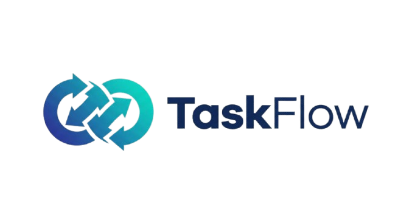

<div align="center">

  
  
  <h1>TaskFlow</h1>
  
  <p>
    <b>Streamline your workflow with intelligent task management ⚡️</b>
  </p>
  
  <p>
    <a href="https://github.com/dhruvkshah75/TaskFlow">
      
    </a>
    <a href="https://github.com/dhruvkshah75/TaskFlow">
      
    </a>
    <a href="https://github.com/dhruvkshah75/TaskFlow/issues">
      
    </a>
    <a href="https://github.com/dhruvkshah75/TaskFlow/releases">
      
    </a>
  </p>

  <p>
    <a href="https://www.docker.com/">
      
    </a>
    <a href="https://kubernetes.io/">
      
    </a>
    <a href="https://fastapi.tiangolo.com/">
      
    </a>
    <a href="https://www.python.org/">
      
    </a>
    <a href="https://redis.io/">
      
    </a>
    <a href="https://www.postgresql.org/">
      
    </a>
    <a href="https://github.com/dhruvkshah75/TaskFlow/actions">
      
    </a>
  </p>
   
  <br />
</div>

## Overview

**TaskFlow** is a robust, production-ready distributed task queue system built to handle asynchronous background processing at scale. Designed with a microservices architecture, it reliably manages, schedules, and executes jobs across multiple concurrent worker nodes with built-in auto-scaling capabilities.

The system leverages **FastAPI** for high-performance task submission and monitoring, **Redis** for efficient message brokering and state management, and **PostgreSQL** for durable persistence of task history and results. By implementing the "Competing Consumers" pattern, TaskFlow ensures load balancing and fault tolerance—if one worker fails, others seamlessly pick up the load.

**Key Capabilities:**
* **One-Command Deployment:** Automated Makefile system deploys the full Kubernetes stack with `make run`
* **Distributed Processing:** Horizontally scalable worker nodes process tasks in parallel
* **Reliable Scheduling:** Intelligent task distribution with Redis-based locking to prevent race conditions
* **Production Ready:** Docker Compose and Kubernetes deployments with automated CI/CD pipelines
* **Persistent & Observable:** Complete audit trail of task states (Queued → Processing → Completed/Failed) via REST endpoints
* **Auto-Scaling:** KEDA-powered autoscaling based on Redis queue depth (0 to 50+ workers dynamically)
* **Continuous Integration:** Automated end-to-end stress testing with 200+ concurrent tasks validation
* **Interactive Showcase:** Live demo website with project overview and system architecture

---

## See TaskFlow in Action

**[taskflow-io.vercel.app](https://taskflow-io.vercel.app/)** - Interactive demonstration with project overview, architecture, and demo videos


  <td style="width: 50%; vertical-align: top;">
    
  </td>
  <td style="width: 50%; vertical-align: top;">
    
  </td>


-----

## CI/CD & Testing

TaskFlow includes automated continuous integration with comprehensive end-to-end testing:

### **Automated Stress Testing**
- **Workflow**: Triggered on every push to main (excluding README changes)
- **Test Coverage**: Deploys full Kubernetes stack with 200+ concurrent task submissions
- **Validation**: Automated verification of task processing, database persistence, and worker scaling
- **Caching**: Docker layer caching for faster builds (~50% reduction in CI time)

### **Run Tests Locally**
```bash
# Using Makefile (recommended)
make stress     # Submit 200 concurrent tasks

# Or directly with Python
python tests/stress-test.py
```

View CI/CD workflows in `.github/workflows/`:
- `ci.yaml` - Standard integration tests
- `ci-caching.yaml` - Optimized workflow with Docker and pip caching
- `delivery.yaml` - Complete CI/CD pipeline with parallel jobs for building Docker images and deploying to Docker Hub and GHCR registry with end-to-end testing

-----

## Kubernetes Deployment (Minikube)

TaskFlow includes a **highly automated Makefile system** that streamlines the entire Kubernetes development lifecycle. Deploy the full stack with a single command.

### **Prerequisites**

- [Minikube](https://minikube.sigs.k8s.io/docs/start/) installed
- [kubectl](https://kubernetes.io/docs/tasks/tools/) CLI tool
- [Docker](https://docs.docker.com/get-docker/) (for Minikube driver)

### **Quick Start: One Command Deployment**

```bash
make run
```

That's it! This single command automatically:
1. Starts Minikube (if not already running)
2. Creates the `taskflow` namespace
3. Generates secrets with default development credentials (if missing)
4. Pulls pre-built images from GitHub Container Registry (GHCR)
5. Loads images into Minikube
6. Deploys all Kubernetes manifests (API, Workers, Redis, PostgreSQL, PgBouncer)
7. Starts Minikube tunnel for service access
8. Sets up port forwarding to `localhost:8080`

**Access the API:**
- Interactive Docs: http://localhost:8080/docs
- Health Check: http://localhost:8080/status

---

### **Makefile Command Reference**

The Makefile provides a complete set of utilities for managing your local Kubernetes environment:

#### **Core Workflow**

| Command | Description |
|---------|-------------|
| `make run` | **Start everything.** Full deployment pipeline (pull → load → apply → forward). |
| `make stop` | **Pause.** Stops Minikube and tunnels (data preserved in cluster). |
| `make clean` | **Reset.** Deletes the `taskflow` namespace and all resources (**data lost**). |
| `make restart` | **Refresh.** Equivalent to `make clean && make run`. |
| `make logs` | Stream **color-coded logs** from all services (API: cyan, Workers: green, Queue Manager: magenta). |
| `make db-shell` | Connect to PostgreSQL with an interactive `psql` session. |
| `make status` | Show running pods, services, and deployments in the `taskflow` namespace. |
| `make watch-scaling` | Monitor worker autoscaling in real-time. |
| `make stress` | Submit 200 concurrent tasks to stress test the system. |
| `make secrets` | Regenerate `k8s/01-secrets.yaml` with default development credentials (only if missing). |
| `make prune` | Free up disk space by deleting Docker build cache and dangling images. |
| `make help` | Display all available commands with descriptions. |

---

### **Secrets Management**

The Makefile intelligently handles secrets:
- **Auto-Generation:** If `k8s/01-secrets.yaml` doesn't exist, `make run` (or `make secrets`) creates it with safe default credentials for local development.
- **No Overwrites:** If the file already exists, it's never modified—ensuring your custom configurations remain intact.
- **Gitignored:** The secrets file is excluded from version control for security.

**Default Development Credentials:**
For production deployments, manually edit `k8s/01-secrets.yaml` or generate from your `.env` file:
```bash
kubectl create secret generic taskflow-db-secret \
  --from-env-file=.env \
  --dry-run=client -o yaml > k8s/01-secrets.yaml
```
---

### **Disk Space Management**

If Docker consumes too much disk space:

```bash
make prune
```

This removes:
- All Docker build cache (`docker builder prune --all`)
- Dangling/unused images (`docker image prune`)

Verify reclaimed space with:
```bash
docker system df
```

---


## Contributing

Contributions are welcome! Please feel free to submit a Pull Request. For major changes, please open an issue first to discuss what you would like to change.

## License

This project is licensed under the MIT License - see the [LICENSE](LICENSE) file for details.

---


